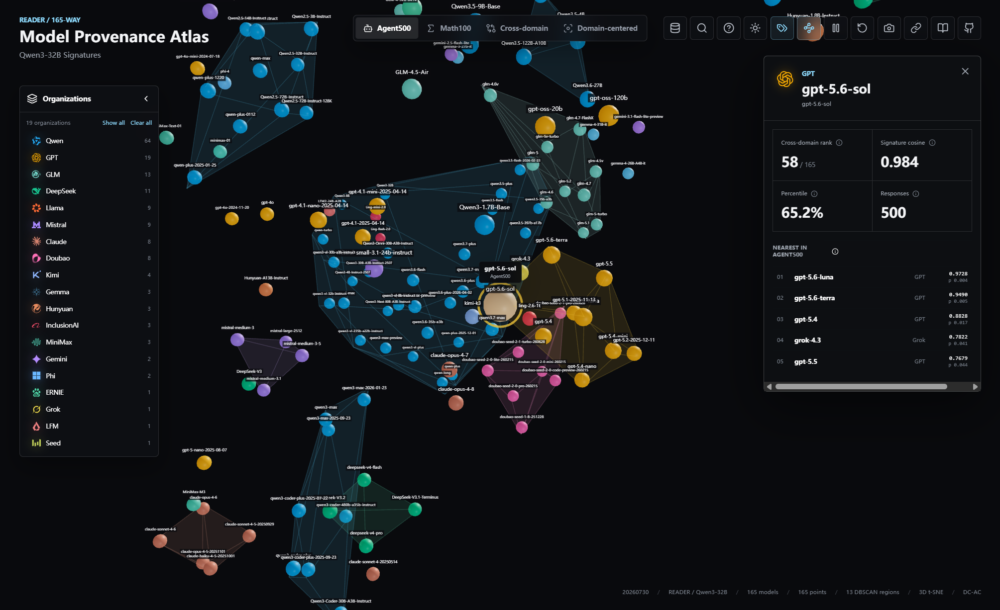

# READER 🔍

**Dynamic LLM Provenance from Query-Varying Interactions**

[English](README.md) | [简体中文](README_zh-CN.md)

[📄 Preprint](https://arxiv.org/abs/2606.10794) · [🌐 Model Provenance Atlas](https://leojeshua.github.io/READER-Atlas/) · [📊 Released results](results/) · [🧪 Reproduction guide](docs/REPRODUCING.md)

READER identifies which enrolled language model produced a black-box response when prompts vary across interactions. A frozen proxy LLM reads each prompt-response pair, converts its response-token activation trajectory into a compact frequency-domain fingerprint, and produces source evidence through a lightweight linear probe. Bayesian evidence accumulation then combines multiple interactions across flexible query budgets.

<p align="center">
  <a href="https://leojeshua.github.io/READER-Atlas/">
    
  </a>
</p>

## ✨ Highlights

- **Dynamic provenance.** Attribution operates on naturally varying queries instead of requiring a fixed diagnostic prompt set at inference time.
- **Temporal fingerprints.** Length-normalized DCT-II coefficients capture complementary DC and AC evidence over the complete response-token trajectory.
- **Lightweight enrollment.** The proxy remains frozen; only a linear source probe is trained for the enrolled ecosystem.
- **Budget-adaptive decisions.** Per-response source evidence is accumulated for any available query budget `K`.
- **Broader diagnostics.** The release includes no-retraining length and Math100 stress tests, static relationship analysis, layer scans, component ablations, and source-geometry visualizations.

## 🧠 Method at a Glance

1. **Read the interaction.** A frozen proxy processes the prompt and generated response, exposing hidden states at a selected layer.
2. **Extract a source fingerprint.** An orthonormal DCT-II summarizes the full response-token trajectory using its DC–AC representation.
3. **Decode response evidence.** A fold-local linear probe maps each fingerprint to evidence over candidate sources.
4. **Accumulate across queries.** Bayesian evidence accumulation combines response-level predictions as the query budget grows.

The canonical pipeline uses all response tokens and the full-rank DC–AC fingerprint. It does not require PCA, GRP, or SVD.

## 📦 Release

| Component | Scope |
|---|---|
| **Agent500** | Dynamic provenance with 500 query-varying prompts per source |
| **Source rosters** | Nested 50-way, 100-way, and 165-way candidate ecosystems |
| **Query budgets** | `K ∈ {1, 5, 10, 20, 50, 100}` |
| **Stress tests** | Controlled response length and no-retraining Math100 transfer |
| **Bench-A** | Pairwise relationship classification with pair-, model-, and family-disjoint protocols |
| **Public data** | 139,200 prompt-response records with checksums and roster metadata |
| **Artifacts** | Compact reports, tables, figures, and regression-tested paper values |

The repository also provides an official-style MMLU-Pro evaluator for OpenAI-compatible APIs. Public files contain no credentials, private endpoints, model weights, cluster paths, or scheduler commands.

## 🚀 Quick Start

READER requires Python 3.10 or newer.

```bash
python -m venv .venv
source .venv/bin/activate
pip install -e '.[plots,dev]'
```

Install the additional sentence-encoder dependencies used by DNA baselines with:

```bash
pip install -e '.[baselines,plots,dev]'
```

Proxy feature extraction requires CUDA and access to the selected Hugging Face checkpoint. Once fingerprints have been extracted, evaluation supports either CPU or CUDA.

### Validate the release

```bash
reader-data --data-root data validate --full
PYTHONPATH=src python tools/validate_release.py --full-data
pytest
```

The full validator checks all 139,200 records, nested rosters, result checksums, paper endpoints, symlinks, and public-release boundaries.

## 🧪 Reproduce the Experiments

### Dynamic provenance on Agent500

Run the canonical Qwen3.5-9B proxy on the 100-way task:

```bash
python workflows/agent500.py \
  --proxy-tag qwen35_9b \
  --variant 100-way \
  --stage all \
  --device cuda \
  --early-exit
```

Outputs are written to `outputs/agent500/100-way/qwen35_9b/`, including the fingerprint archive, fold-local probes, out-of-fold response evidence, and query-budget report. Use `--stage evaluate --device cpu` to evaluate an existing fingerprint archive without another proxy forward pass. The same workflow accepts `50-way` and `165-way`.

### No-retraining stress tests

```bash
python workflows/stress_tests.py \
  --proxy-tag qwen35_9b \
  --variant 100-way \
  --condition all \
  --stage all \
  --device cuda \
  --early-exit
```

### Static relationship evaluation

```bash
python workflows/bench_a.py \
  --proxy-tag qwen35_9b \
  --stage all \
  --device cuda \
  --early-exit
```

Task-specific readout layers are recorded as `layer` and `bench_a_layer` in [`configs/proxies.yaml`](configs/proxies.yaml). Both evaluations use the same DC–AC fingerprint construction.

## 📈 Analyses and Paper Artifacts

```bash
python workflows/input_ablation.py --proxy-tag qwen35_9b --stage all
python workflows/layer_scan.py --proxy-tag qwen35_9b --stage all

MPLCONFIGDIR=.cache/matplotlib reader-report \
  --results results \
  --proxy-config configs/proxies.yaml \
  --capabilities configs/capabilities.yaml \
  --output-dir outputs/paper
```

`reader-report` regenerates the attribution, stress-test, component, layer, variance, and capability figures together with machine-readable tables. Dedicated commands expose out-of-fold confusion matrices (`reader-confusion`), source geometry (`reader-geometry`), and bootstrap, sign-flip, and Holm-corrected statistics (`reader-statistics`).

Protocol definitions and complete commands are documented in [`docs/PROTOCOL.md`](docs/PROTOCOL.md) and [`docs/REPRODUCING.md`](docs/REPRODUCING.md). Released paper artifacts are indexed by [`results/paper_map.json`](results/paper_map.json).

## 🗂️ Repository Structure

```text
configs/                  Model rosters and experiment definitions
data/                     Prompts, responses, splits, and checksums
results/                  Compact reports and paper figures
src/reader_provenance/    Numerical core and experiment entry points
workflows/                End-to-end experiment orchestration
tests/                    Unit, integration, and paper-value tests
tools/                    Release validation utilities
mmlu_pro_api/             OpenAI-compatible MMLU-Pro evaluation
```

The independent [Model Provenance Atlas](https://leojeshua.github.io/READER-Atlas/) provides an interactive view of model-signature geometry across readers and attribution methods.

## 📄 Data and License

Code is released under the [MIT License](LICENSE). Prompt and response data are provided for research reproduction and remain subject to the applicable model and provider terms. See [`data/README.md`](data/README.md) for schemas, counts, checksums, and retained Bench-A empty-response cases.

## 📝 Citation

```bibtex
@misc{liu2026reader,
  title         = {READER: Dynamic LLM Provenance from Query-Varying Interactions},
  author        = {Liu, Jiaxu and Mu, Sunnan and Huang, Dong and Wang, Liuyin and Shao, Jing and Zhang, Jie},
  year          = {2026},
  eprint        = {2606.10794},
  archivePrefix = {arXiv},
  primaryClass  = {cs.AI},
  doi           = {10.48550/arXiv.2606.10794}
}
```
